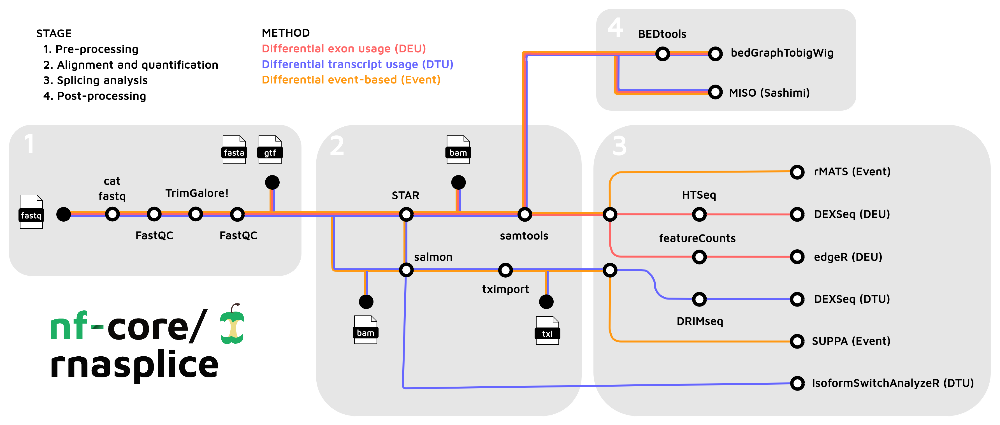
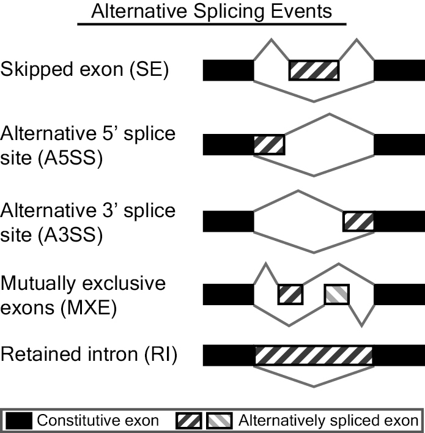
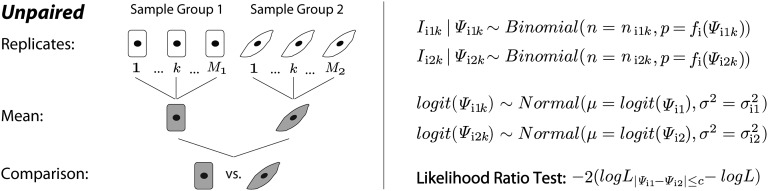
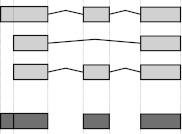
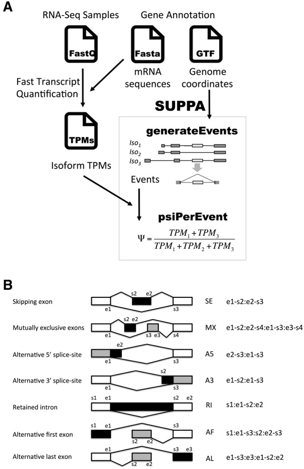

```{r}
#| label:  setup
#| include: false
# Load required libraries
library(DT)
library(ggplot2)
library(dplyr)
library(tidyr)
library(readr)
library(knitr)
library(plotly)
# For better pipes %>% %<>%
library(magrittr)
# Work with for loops (map) and nested lists (pluck)
library(purrr)
# required to load r object specific for this package
#renv::install("bioc::IsoformSwitchAnalyzeR")
library(IsoformSwitchAnalyzeR)
#library(VennDiagram)
library(edgeR)
#renv::install("bioc::stageR")
library(stageR)

# Set global options
options(stringsAsFactors = FALSE)
knitr::opts_chunk$set(
  echo = TRUE,
  warning = FALSE,
  message = FALSE,
  fig.align = 'center'
)

# Custom theme for ggplot2
theme_set(theme_bw(base_size = 12))

# Function to create interactive table with download buttons
create_interactive_table <- function(data, caption = NULL, pageLength = 10) {
  datatable(
    data,
    caption = caption,
    extensions = 'Buttons',
    options = list(
      dom = 'Bfrtip',
      buttons = c('copy', 'csv', 'excel'),
      pageLength = pageLength,
      scrollX = TRUE,
      autoWidth = TRUE
    ),
    filter = 'top',
    rownames = FALSE,
    class = 'cell-border stripe hover'
  )
}

# Function to safely load data with error handling
safe_load_data <- function(file_path, file_type = "auto") {
  if (!file.exists(file_path)) {
    warning(paste("File not found:", file_path))
    return(NULL)
  }
  
  tryCatch({
    if (file_type == "rds" || grepl("\\.rds$", file_path, ignore.case = TRUE)) {
      return(readRDS(file_path))
    } else if (file_type == "csv" || grepl("\\.csv$", file_path, ignore.case = TRUE)) {
      return(read_csv(file_path, show_col_types = FALSE))
    } else if (file_type == "tsv" || grepl("\\.(tsv|txt)$", file_path, ignore.case = TRUE)) {
      return(read_tsv(file_path, show_col_types = FALSE))
    } else {
      return(read_delim(file_path, show_col_types = FALSE))
    }
  }, error = function(e) {
    warning(paste("Error loading file:", file_path, "-", e$message))
    return(NULL)
  })
}


```

```{r}
#| label: base dir and params
# ===================================================================
# CONFIGURE YOUR DATA PATHS HERE
# ===================================================================
# Modify these paths to point to your nf-core/rnasplice output files

# Base output directory (adjust to your pipeline output location)
base_dir <- params$base_dir

### Set parameters ###

effect_size_cutoff <- params$effect_size_cutoff
fdrThreshold <- params$fdrThreshold
topN <- params$topN


# Get gene symbols from gtf used in the pipeline

# Provide path to your gtf
gtf <- params$gtf

# If no gtf provided, try to get the gtf from pipeline params automatically 
if (is.null(gtf) || gtf == "") {
  logger::log_info("No GTF provided. Searching pipeline_info...")
  
  info_path <- fs::path(base_dir, "pipeline_info")
  json_files <- list.files(info_path, "params_.*\\.json$", full.names = TRUE)
  
  if (length(json_files) > 0) {
    # Sort to ensure we get the truly latest file
    latest_json <- sort(json_files) %>% tail(1)
    gtf <- jsonlite::read_json(latest_json)$gtf
    logger::log_info("Found GTF in {basename(latest_json)}: {gtf}")
  }
}


# Initialize gene_info as FALSE; only set to TRUE if import succeeds
gene_info <- FALSE

# nzchar is a fast way to find out if elements of a character vector are non-empty strings. 
if (!is.null(gtf) && nzchar(gtf) && file.exists(gtf)) {
  logger::log_info("Importing GTF: {gtf}")
  
  # Import only necessary features to save memory
  gtf_data <- rtracklayer::import(gtf, feature.type = c("gene", "transcript"))
  
  # Convert to data frame and select columns
  tx2gene <- as.data.frame(gtf_data) %>%
    dplyr::select(gene_id, gene_name, gene_biotype, transcript_id, transcript_biotype) %>% # gene_name is usually the symbol
    distinct()
  
  # Smaller df for only genes:
  gene_map <- tx2gene %>%
    dplyr::select(gene_id, gene_name, gene_biotype) %>%
    distinct() %>% 
  # If gene name is misisng, still supply gene_id to avoid NA
    mutate(gene_name = replace_values(gene_name, NA ~ gene_id))
  
  # Remove large object and free memory
  rm(gtf_data)
  a <- gc()
  
  # Set the switch for adding gene info
  gene_info <- TRUE

  
} else {
  # Provide a descriptive warning based on what happened
  reason <- if (is.null(gtf) || gtf == "") "path is empty" else "file not found"
  logger::log_warn("GTF {reason} ({gtf}). Gene/Transcript info will be omitted.")
}


# Function to add gene info to data.frame or tibble
# Returns original df if the switch if F
add_gene_info <- function(df, id_col = "gene_id"){
  if(gene_info){
    return(left_join(df, gene_map , by = join_by(!!id_col == gene_id)))
  } else {
    return(df %>% mutate(gene_name="", gene_biotype=""))
  }
}

```


# Overview

This report summarizes the results from the [nf-core/rnasplice](https://nf-co.re/rnasplice/dev/) pipeline, which performs comprehensive differential splicing analysis using multiple complementary tools. The pipeline integrates both event-based and transcript-level approaches to detect alternative splicing changes between conditions.

## Analysis Tools

Abbreviations:

- **DEU** : differential exon usage
- **DTU** : differential transcript usage
- **Event** : alternative splicing events (exon skipping, retained introns, alternative 5- and 3' splice sites, mutually exclusive exons)

This report includes results from six major splicing analysis tools from two quantification methods:

Methods that use read counts from STAR alignment:

-   [**rMATS (Event)**](#rmats): Event-based detection of differential alternative splicing 
-   [**DEXSeq (DEU)**](#dexseq_deu): Differential exon usage analysis
-   [**edgeR (DEU)**](#edger): Differential exon expression analysis

Methods that use transcript-level quantification from salmon:

-   [**DEXSeq (DTU)**](#dexseq_dtu): Differential transcript usage analysis
-   [**SUPPA (Event)**](#suppa): Event-based differential splicing with PSI quantification
-   [**IsoformSwitchAnalyzeR (DTU)**](#isoform): Genome-wide isoform switch detection





# Results by Tool

# rMATS - Differential Alternative Splicing Events {#rmats}


[rMATS](https://rnaseq-mats.sourceforge.io/) (replicate Multivariate Analysis of Transcript Splicing) detects differential alternative splicing events from replicate RNA-Seq data. It identifies five types of alternative splicing events:

-   **SE**: Skipped Exon
-   **MXE**: Mutually Exclusive Exons
-   **A3SS**: Alternative 3' Splice Site
-   **A5SS**: Alternative 5' Splice Site
-   **RI**: Retained Intron



The statistical model of MATS calculates the P-value and false discovery rate that the difference in the isoform ratio of a gene between two conditions exceeds a given user-defined threshold. An extension of MATS, [rMATS](https://pmc.ncbi.nlm.nih.gov/articles/PMC4280593/), is designed for detection of differential alternative splicing from replicate RNA-Seq data.

The AS event (e.g. exon inclusion) level $\psi$ is estimated by:

  -   the count of reads specific to the event-containing isoform $I$

  -   the count of reads specific to the event excluding isoform $S$





From the publication:

- rMATS models alternative splicing events, such as exon inclusion levels ($\psi$), as a hierarchical framework, to account for estimation uncertainty both in individual replicates and among the replicates
- rMATS uses flexible hypothesis testing where null and alternative hypotheses are defined by user (specifically: likelihood-ratio test that the difference in mean $\psi$ values between the groups exceed user-defined threshold, e.g. $|\Delta\psi| = | \psi_{i1} - \psi_{i2} | > 5\%$)

The default [cutoff](https://nf-co.re/rnasplice/dev/parameters/#rmats_splice_diff_cutoff) used by the nf-core/rnasplice = `0.0001` which is [default in rMATS](https://github.com/Xinglab/rmats-turbo/blob/v4.3.0/README.md#all-arguments) for 0.01% difference.


```{r}
#| label:  rmats-path
# rMATS paths - adjust contrast name as needed
# There are 2 types: JC and JCEC, both of which can be used.
# "The JC files only consider "junction counts" while the JCEC files consider both "junction counts" and "exon counts". [...] 
# The JC files are more strict in that they only count the junction reads which provide better evidence to support the event. 
# The JCEC files include the additional exon count data which may result in more significant events from the statistical analysis."
# see diagram https://github.com/Xinglab/rmats-turbo#output

# #TODO potentially include fromGTF.novelSpliceSite and novelJunction events
# (fromGTF.[AS].txt is event definition file and JC/JCEC are counts files)
# However they all seem to be empty - check if nf-core included --novelSS option

# Discover contrasts
rmats_contrasts <- list.files(file.path(base_dir, "star_salmon", "rmats"), pattern = "[^bamlist]") 


# Loop over all contrasts 
rmats_paths <- purrr::map(rmats_contrasts, ~ {
  rmats_dir <- file.path(base_dir, "star_salmon", "rmats", .x , "rmats_post")
  list(
    SE = file.path(rmats_dir, "SE.MATS.JC.txt"),
    MXE = file.path(rmats_dir, "MXE.MATS.JC.txt"),
    A3SS = file.path(rmats_dir, "A3SS.MATS.JC.txt"),
    A5SS = file.path(rmats_dir, "A5SS.MATS.JC.txt"),
    RI = file.path(rmats_dir, "RI.MATS.JC.txt")
  )
})

# Name the nested paths list
names(rmats_paths) <- rmats_contrasts

# Calculate figure height based on number of contrasts
long_fig_height = 5*round(length(rmats_contrasts)/2)
```

```{r}
#| label:  rmats-load

# Loop for each contrast
# Collect all results in one tibble instead of nested list
# Only get significant results based on FDR threshold or get all results

rmats_datas <- imap_dfr(
  rmats_paths,
  ~ imap_dfr(.x, function(f, event_type) {

    d <- safe_load_data(f, "tsv")

    if (is.null(d) || !"FDR" %in% names(d)) {
      return(NULL)
    }

    d %>%
      # Remove ID
      dplyr::select(-any_of(starts_with("ID.."))) %>% 
      #filter(FDR < fdrThreshold) %>%
      mutate(
        contrast = .y,
        event_type = event_type
      ) #%>% add_gene_info(id_col = "GeneID") # has geneSymbol already
  })
)


```

```{r}
#| label: rmats-notfound
#| output: asis
#| echo: false
if(nrow(rmats_datas)==0){
  cat("::: {.callout-warning}\n")
  cat("## rMATS Data Not Found\n")
  cat("No rMATS result files were found for any contrast. Please check the file paths in the configuration section.\n")
  cat(":::\n")
}
```

## Summary Statistics


```{r}
#| label: rmats-barplots
#| fig-cap: "rMATS Event Distribution."
#| fig-height: !expr long_fig_height

rmats_datas %>% 
  filter(FDR < fdrThreshold) %>% # only take significant events
  reframe(n_events=n(), .by=c(event_type,contrast)) %>% 
  ggplot(aes(
    x = reorder(event_type, -n_events)
    , y = n_events
    , fill = event_type
  )) +
  geom_bar(stat = "identity", alpha = 0.8) +
  geom_text(aes(label = n_events), vjust = -0.5, size = 3) +
  facet_wrap(~contrast, ncol = 2) +
  labs(
    title = "Distribution of Significant Alternative Splicing Events",
    subtitle = paste0("Detected by rMATS (FDR < ", fdrThreshold,")"),
    x = "Event Type",
    y = "Number of Events",
    fill = "Event Type"
  )
  
```


## Significant Events by Type


```{r}
#| label: rmats-tables
#| results: asis
#| echo: false

#TODO add description of all columns https://www.biostars.org/p/256949/#274010

cat("::: {.panel-tabset}\n\n")

# Split the tibble by the outer grouping by contrast
rmats_datas %>%
  filter(FDR < fdrThreshold) %>% # only take significant events
  dplyr::group_split(contrast) %>% 
  
  # Print tables of top events for each contrast
  purrr::walk( ~{
    
    # Extract contrast name
    cntr <- unique(.x$contrast)
    
    # Start outer tab
    cat("\n###", as.character(cntr), "{.panel-tabset}\n\n")
    
    # Make inner groups by event type
    .x %>%
      group_split(event_type) %>% 
      
      # Loop through each group
      purrr::iwalk( ~{
        
        # Check if the group is empty
        if (nrow(.x) == 0) return(NULL)
        
        # Get the group name for the tab title
        tab_title <- unique(.x$event_type)
        
        # Start inner tab
        cat("\n####", as.character(tab_title), "\n\n")
        
        .x %>% 
          # Drop columns that are all NA for group
          dplyr::select(where(~ !all(is.na(.)))) %>% 
          # Print interactive html table only if not empty
          {if(nrow(.) > 0) {
            
            widget <- datatable(.,
                                extensions = 'Buttons',
                                options = list(
                                  pageLength = 5,
                                  dom = 'Blfrtip',
                                  scrollX = TRUE,
                                  autoWidth = TRUE,
                                  buttons = c('copy', 'csv', 'excel')
                                  ), elementId = paste0("table_", .y))%>%
              # Use Scientific Notation for P-values to avoid "0.000"
              formatSignif(columns = c('PValue','FDR'), digits = 3)
            
            cat(htmltools::renderTags(widget)$html)
            } else {
              cat("No data for this combination.")
            }
          }
        # Add extra newlines so the next header is recognized
        cat("\n\n")
      })

  })

cat(":::\n\n")
```


## Volcano Plots

```{r}
#| label: rmats-volcanoplots
#| results: asis
#| echo: false
##| fig-cap: "rMATS Volcano Plots."


# Consistent manual color scheme for rMATS event types
rmats_colors <- c(
  "SE"   = "#66C2A5", # Greenish
  "RI"   = "#FC8D62", # Orange
  "MXE"  = "#8DA0CB", # Blue-ish
  "A5SS" = "#E78AC3", # Pink
  "A3SS" = "#A6D854"  # Light Green
)


# Create volcano plots for each contrast showing all event types

cat("::: {.panel-tabset}\n\n")

rmats_datas %>%
  dplyr::group_split(contrast) %>% 
  
  # Print tables of top events for each contrast
  purrr::walk( ~{
    
    # Extract contrast name
    cntr <- unique(.x$contrast)
    
    # Check if the group is empty
    if (nrow(.x) == 0) return(NULL)
    
    # Start inner tab
    cat("\n####", as.character(cntr), "\n\n")
    
    # Mark top N genes
    tolabel <- .x %>% slice_min(order_by = FDR, n=10, with_ties = FALSE, na_rm = TRUE)
    
    # Volcano plot of all events
    p <- ggplot(.x, aes(x = IncLevelDifference, y = -log10(FDR), color = event_type)) +
      geom_point(alpha = 0.6, size = 2) +
      geom_hline(yintercept = -log10(fdrThreshold), linetype = "dashed", color = "red") +
      labs(
        title = paste("Volcano Plot of Alternative Splicing Events"),
        subtitle = paste("FDR <", fdrThreshold, "threshold shown as red dashed line"),
        x = "Inclusion Level Difference (ΔΨ)",
        y = "-log10(FDR)",
        color = "Event Type"
      ) +
      theme_minimal(base_size = 14) +
      theme(
        plot.title = element_text(face = "bold", hjust = 0.5),
        plot.subtitle = element_text(hjust = 0.5),
        legend.position = "right"
      ) + 
      ggrepel::geom_label_repel(data = tolabel,
                                  aes(label = geneSymbol),
                                  show.legend = FALSE,
                                  size = 4,
                                  force = 10,
                                  box.padding = 0.5,
                                  point.padding = 0.3,
                                  max.overlaps = Inf) +
      scale_color_manual(values = rmats_colors)


    print(p)
    # Add extra newlines so the next header is recognized
    cat("\n\n")
  })

  
cat(":::\n\n")

```


```{r}
#| label: rmats for upset and gc

# upset needs vector of gene ids
# use a list of lists and unite by event type later
rmats_for_upset <- rmats_datas %>% 
  dplyr::filter(FDR < fdrThreshold) %>%
  dplyr::select(GeneID,event_type,contrast) %>% 
  #dplyr::group_split(.by = event_type, .keep = FALSE) # there is no naming option in group_split
  #use base R split
  { split(., .$event_type) } %>% 
  purrr::map(~ split(.x$GeneID, .x$contrast))


rm(rmats_datas)
a <- gc()
```


------------------------------------------------------------------------


# DEXSeq - Differential Exon Usage {#dexseq_deu}

[DEXSeq](https://pmc.ncbi.nlm.nih.gov/articles/PMC3460195/) uses generalized linear models to identify differential exon usage from RNA-Seq data by testing whether the usage of individual exons changes between experimental conditions.

The counts are modeled to follow a negative binomial distribution.

The data structure for the model is a flattened gene model where counting bins (dark grey) are either exons or a unique parts of an exon (in case of overlapping exons).



The likelihood ratio test is performed comparing the full generalized linear model with the formula `~sample + exon + condition:exon` to the reduced null model `~ sample + exon`.

Output files:

 - DEXSeqDataSet.{contrast}.rds: DEXSeqDataSet R object.
 - DEXSeqResults.{contrast}.rds: DEXSeqResults R object following `DEXSeq::DEXSeqResults()` call (contains results).
 - DEXSeqResults.{contrast}.csv: CSV results table of DEXSeq DEU analysis with log2foldchanges and p-values.
 - perGeneQValue.{contrast}.rds: DEXSeq R Object following DEXSeq::perGeneQValue containing q-values per gene.
 - perGeneQValue.{contrast}.csv: CSV file of q-values for perGeneQValue.*.rds R Object.
 - plotDEXSeq.{contrast}.pdf : PDF file of top N genes from DEXSeq results.

DEXSeqResults.{contrast}.csv and DEXSeqDataSet.{contrast}.rds results output only contain p-values and q-values on a per-exon level, therefore, perGeneQValue* results are also provided which contain FDR at the gene level.

```{r}
#| label:  dexseq-path

# DEXSeq paths - automatically discover all contrasts
dexseq_dir <- file.path(base_dir, "star_salmon/dexseq_exon/results")

# List contrasts from DEXSeqResults files
dexseq_pattern <- "DEXSeqResults\\.(\\w+)\\.csv"
dexseq_files <- list.files(dexseq_dir, pattern = dexseq_pattern)
dexseq_contrasts <- stringr::str_extract(dexseq_files, dexseq_pattern, group = 1)

# Build paths for each contrast
dexseq_paths <- purrr::map(dexseq_contrasts, ~ {
  list(
    results = file.path(dexseq_dir, paste0("DEXSeqResults.", .x, ".csv")),
    pergene = file.path(dexseq_dir, paste0("perGeneQValue.", .x, ".csv"))
  )
})

# Name the nested paths list
names(dexseq_paths) <- dexseq_contrasts
```

```{r}
#| label: dexseq-load

#library(DEXSeq) #use csv rather than dxd objects

# Make a list of results tables per contrast
# (united tibble does not work because each log2fc is named by contrast)
# TODO rename columns back or keep it a list per contrast
logger::log_info("Loading DEXseq data...")
dexseq_datas <- imap(
  dexseq_paths, # this will go over each contrast
  ~ {

    d <- safe_load_data(.x$results)
    pergene <- safe_load_data(.x$pergene)

    d %<>%
      left_join(pergene, by = "groupID", suffix = c(".exon",".gene")) %>% 
      mutate(
        contrast = .y,
        # duplicate groupID column because separate will destroy it
        geneID = groupID
      ) %>%
      # separate groupID into single gene ids
      # this will duplicate all data for each gene of the group
      tidyr::separate_longer_delim(geneID, delim = "+") %>%
      # add gene name
      add_gene_info(id_col = "geneID")

    
    return(d)
  })


# Check if ANY contrast has data
any_dexseq_loaded <- any(map_lgl(dexseq_datas, ~ nrow(.x)>0))
```

```{r}
#| label: dexseq-notfound
#| eval: !expr "!any_dexseq_loaded"
#| output: asis
#| echo: false
cat("  {.callout-warning}\n")
cat("## DEXSeq Data Not Found\n")
cat("No DEXSeq result files were found for any contrast or no significant results. Please check the file paths in the configuration section.\n")
cat(" \n")
```


## Summary Statistic

This table shows number of significant exons per comparison and number of unique genes to which these exons belong.

```{r}
#| label: dexseq-summary-tables
#| eval: !expr any_dexseq_loaded
#| output: asis
#| echo: false
# How many significant exons and how many unique genes to which they belong?

knitr::kable(
  imap_dfr(dexseq_datas, ~ .x %>%
             summarise(
               comparison=.y
               ,total_exons=nrow(.x)
               ,number_sign_exons=sum(padj.exon<0.05, na.rm=TRUE)
               ,number_sign_genes=n_distinct(groupID[padj.exon < 0.05]),
               , .groups = "drop"))
)
```

 


## Volcano Plots 

 

```{r}
#| label: dexseq-volcano-plots
#| eval: !expr any_dexseq_loaded
#| output: asis
#| echo: false
# fig.width=10, fig.height=7

cat("\n\n::: {.panel-tabset} \n\n")

# Create volcano plot for each contrast
purrr::iwalk(dexseq_datas, ~ {
  
  # Check if results are not empty
  if (nrow(.x) > 0) {
    
    # Make a subtab
    cat("\n\n### ", .y, "\n\n")
    
    # # Determine log2 fold change column
    log2fc_col <- grep("^log2fold", colnames(.x), value = TRUE)[1]
    
    if (!is.null(log2fc_col)) {
      volcano_data <- .x %>%
        filter(!is.na(!!sym(log2fc_col)), !is.na(padj.exon)) %>%
        mutate(
          neg_log10_padj = -log10(padj.exon),
          significance = case_when(
            padj.exon < fdrThreshold & abs(!!sym(log2fc_col)) > 1 ~ "Significant & Large Effect",
            padj.exon < fdrThreshold ~ "Significant",
            TRUE ~ "Not Significant"
          )
        )
      
      # 10 genes to label
      label_data <- volcano_data %>%
        filter(significance=="Significant & Large Effect") %>%
        slice_min(order_by=padj.exon, n=10)
      
      p <- ggplot(volcano_data, aes(x = !!sym(log2fc_col), y = neg_log10_padj, color = significance)) +
        geom_point(alpha = 0.5, size = 1.5) +
        scale_color_manual(values = c(
          "Significant & Large Effect" = "#e41a1c",
          "Significant" = "#377eb8",
          "Not Significant" = "grey60"
        )) +
        geom_hline(yintercept = -log10(fdrThreshold), linetype = "dashed", color = "black") +
        geom_vline(xintercept = c(-1, 1), linetype = "dashed", color = "black") +
        labs(
          title = paste("DEXSeq Differential Exon Usage -", .y),
          subtitle = "Volcano plot showing log2 fold change vs. adjusted p-value",
          x = "Log2 Fold Change",
          y = "-Log10(Adjusted P-value)",
          color = "Category"
        ) +
        theme_minimal(base_size = 14) +
        theme(
          legend.position = "bottom",
          plot.title = element_text(face = "bold", hjust = 0.5),
          plot.subtitle = element_text(hjust = 0.5)
        ) +
        ggrepel::geom_label_repel(data=label_data,
                                  aes(label = gene_name),
                                  show.legend = FALSE,
                                  max.overlaps = Inf,    # This forces all labels to show
                                  force = 10,            # Higher "push" to get labels away from dense point clusters
                                  box.padding = 0.5      # Give labels more room to breathe
                                  )
      
      #TODO fix interactivity
      #print(ggplotly(p, tooltip = c("x", "y", "colour")))
      #print(p)
      knitr::knit_print(p)
    } else {
      cat("\n\n Log2 fold change or adjusted p-value column not found in DEXSeq data.\n\n")
    }
    
    cat("\n\n")
  }
})

cat("\n\n:::\n\n")
```


## Differentially Used Exons

```{r}
#| label: htmltools init dexseq
#| include: false
# Init Step to make sure that the dependencies are loaded
#htmltools::tagList(datatable(mtcars %>% head(0)))
```


```{r}
#| label: dexseq-top-exons-tables
#| eval: !expr any_dexseq_loaded
#| output: asis
#| echo: false


# TODO make it interactive html tables and fix panel tabset


cat("::: {.panel-tabset}\n\n")

# Create a tab for each contrast
purrr::iwalk(dexseq_datas, ~ {
  
  if (nrow(.x)>0) {
    cat("### ", .y, "\n\n")
    
    # Output number of significant per-gene q values in one line
    pergene <- .x %>%
      dplyr::select(groupID, padj.gene) %>%
      distinct() # %>%  arrange(padj.gene)
    sig_genes <- sum(pergene$padj.gene < fdrThreshold, na.rm = TRUE)
    cat(paste0("\nGenes with significant differential exon usage (gene-level q-value < ",fdrThreshold, "): ", 
                  sig_genes, " / ", nrow(pergene), "\n\n"))
    
    # # Determine log2 fold change column
    log2fc_col <- grep("^log2fold", colnames(.x), value = TRUE)[1]
    
    # Display top significant exons
    dexseq_display <- .x %>%
      filter(padj.exon < fdrThreshold) %>% 
      arrange(padj.exon) %>%
      #head(topN) %>% #just output all significant
      dplyr::select(any_of(c("featureID", "exonBaseMean", log2fc_col, "pvalue", "padj.exon", "geneID", "exonID", "genomicData.seqnames", "genomicData.start", "genomicData.end", "groupID")))
    

    # Rename columns for clarity
    if (ncol(dexseq_display) > 0) {
      colnames(dexseq_display) <- gsub("genomicData\\.", "", colnames(dexseq_display))
      
      # Select numeric and pvalue cols for rounding
      # Get all numeric columns
      all_num_cols <- dexseq_display %>% dplyr::select(where(is.numeric)) %>% names()
        
      # Separate P-value-like columns from the rest
      p_cols <- grep("pvalue|padj|fdr", all_num_cols, ignore.case = TRUE, value = TRUE)
      other_nums <- setdiff(all_num_cols, p_cols)
      
      # Print interactive html table only if not empty
      widget <- datatable(dexseq_display,
                                extensions = 'Buttons',
                                options = list(
                                  pageLength = 10,
                                  dom = 'Blfrtip',
                                  scrollX = TRUE,
                                  autoWidth = TRUE,
                                  buttons = c('copy', 'csv', 'excel')
                                  ), elementId = paste0("table_", .y)) %>%
        # Round numeric columns
        formatRound(columns = other_nums, digits = 3) %>%
        # Use Scientific Notation for P-values to avoid "0.000"
        formatSignif(columns = p_cols, digits = 3)
    
      cat(htmltools::renderTags(widget)$html)
    }
    
    cat("\n\n")
  }
})

cat("\n\n:::\n\n")
```

 

## Exon Usage Distribution


```{r}
#| label: dexseq-distribution-plots
#| eval: !expr any_dexseq_loaded
#| output: asis
#| echo: false

cat("::: {.panel-tabset} \n\n")

# Create distribution plot for each contrast showing significant exons per gene
purrr::iwalk(dexseq_datas, ~ {
    cat("### ", .y, "\n\n")
    
    # Count significant exons per gene
    exons_per_gene <- .x %>%
      filter(padj.exon < fdrThreshold) %>%
      dplyr::count(gene_name, name = "n_significant_exons") %>%  # group_by + summarise(n())
      arrange(desc(n_significant_exons)) %>%
      mutate(
      # Make short ID which won't break plots - only first gene name (they are separated by "+" sign)
      #   shortID = str_remove(groupID, "\\+.+"),
      #   shortID = forcats::fct_reorder(shortID, n_significant_exons)
      # Arrange again by n exons
        gene_name = forcats::fct_reorder(gene_name, n_significant_exons)
      )
  
    if (nrow(exons_per_gene) == 0) {
      cat("No data available for distribution plot.\n\n")
      return(NULL)
    }
    
    # Plot top 20 genes
    
    top_genes <- head(exons_per_gene, 20)
  
    p <- ggplot(top_genes, aes(x = gene_name, y = n_significant_exons)) +
      geom_col(fill = "#377eb8", alpha = 0.8) +
      geom_text(aes(label = n_significant_exons), hjust = -0.3, size = 3.5) +
      coord_flip() +
      labs(
        title = paste("Top 20 Genes by Number of Differentially Used Exons -", .y),
        subtitle = "Genes with most significant exons (padj < 0.05)",
        x = "Gene name",
        y = "Number of Significant Exons"
      ) +
      theme_minimal(base_size = 12) +
      theme(
        plot.title = element_text(face = "bold", hjust = 0.5),
        plot.subtitle = element_text(hjust = 0.5),
        axis.text.y = element_text(size = 10)
      ) +
      scale_y_continuous(expand = expansion(mult = c(0, 0.1)))
    
    print(p)
    
    cat("\n\n")
})


cat("::: \n\n")

```


```{r}
#| label: save hits for upset and gc

# Only take for overlap significant genes (broadly: at least one sign exon)
DEXseq_for_upset <- purrr::map(dexseq_datas, ~ .x %>% filter(padj.exon < fdrThreshold) %>% pull(geneID) %>% unique())

rm(dexseq_datas)
a <- gc() # assign output to variable to silence it
```


------------------------------------------------------------------------


# edgeR - Differential Exon Usage Analysis {#edger}

[edgeR](https://bioconductor.org/packages/release/bioc/html/edgeR.html) performs differential expression analysis at the exon or gene level to identify changes in expression between conditions.

edgeR also uses [negative binomial generalized linear model](https://academic.oup.com/nar/article/53/2/gkaf018/7973897) to model read counts. In case of DEU analysis,

> "NB GLMs are fitted to the exon counts and exon-level NB-dispersions are estimated, as would be done for a gene-level analysis but at the exon level."

Outputs:

- DGEList.rds and DGEGLM.rds R objects - contain the first steps of the edgeR analysis
- DGELRT.exprs.rds and DGELRT.usage.rds R objects  - following differential exon expression and differential exon usage steps respectively
- {contrast}.usage.usage.csv - differential exon usage results
- {contrast}.usage.gene.csv - results at a gene level identified with F-tests
- {contrast}.usage.simes.csv - results at a gene level using the Simes adjustment

From [edgeR User’s Guide](https://bioconductor.org/packages/release/bioc/vignettes/edgeR/inst/doc/edgeRUsersGuide.pdf):

  > Two different methods can be used to examine the differential splicing results at the gene level: the Simes' method and the gene-level F-test. The Simes' method is likely to be more powerful when only a minority of the exons for a gene are differentially spliced. The F-tests are likely to be powerful for genes in which several exons are differentially spliced.

See [nf-core script](https://github.com/nf-core/rnasplice/blob/dev/bin/run_edger_exon.R) for more details of the analysis performed by rnasplice pipeline.

```{r}
#| label: edger-paths
# edgeR paths
edger_dir <- file.path(base_dir, "star_salmon", "edger") 
# Load edgeR object (a list per contrast)
DGELRT.usage <- readRDS(file.path(edger_dir, "DGELRT.usage.rds"))
# Get contrasts
contrast_names <- names(DGELRT.usage)
```


```{r}
#| label:  edger overview
#| 
# Get all results again from the object instead of importing csvs one by one
results.usage <- list(
    simes = lapply(DGELRT.usage, topSpliceDGE, test = "Simes", number = Inf),
    gene  = lapply(DGELRT.usage, topSpliceDGE, test = "gene", number = Inf),
    exon  = lapply(DGELRT.usage, topSpliceDGE, test = "exon", number = Inf)
)

overview <- 
  map_dfr(contrast_names, function(cn) {
  tibble(
    comparison = cn,
    n_genes = nrow(results.usage$gene[[cn]]),
    n_signif_F_test = sum(results.usage$gene[[cn]]$FDR<fdrThreshold),
    n_signif_Simes_test = sum(results.usage$simes[[cn]]$FDR<fdrThreshold)
  )
})

knitr::kable(overview)
```

```{r datatableinit, include=FALSE, echo = TRUE}
# Trick to include datatable in tabsets
# https://github.com/simoncoulombe/snippets_quarto/blob/main/posts/2024-05-11-how-to-loop-stuff-in-tabset--quarto-edition/index.qmd
# Init Step to make sure that the dependencies are loaded
#htmltools::tagList(datatable(mtcars %>% head(0)))
```

```{r}
#| label: summary per contrast
#| output: asis
#| echo: false
# Put both p-values together and plot against each other
# TODO iwalk

cat(":::: {.panel-tabset} \n\n")


for (cn in contrast_names) {

  #res <- edger_object[[cn]]

  # Summarize gene results and filter for significant only
  # Both tables should have same gene ids - only sorted differently by padj
  
  gene_res <- as_tibble(results.usage$gene[[cn]]) %>% 
    inner_join(as_tibble(results.usage$simes[[cn]]),
               by = c("Geneid", "Chr","Strand", "NExons"),
               suffix = c(".gene",".simes")) %>% 
    filter(FDR.gene < fdrThreshold | FDR.simes < fdrThreshold) %>% 
    add_gene_info(id_col = "Geneid")

  # Genes for labeling with gene name
  top_N <- 20
  top_genes <- gene_res %>%
  slice_min(order_by = P.Value.simes, n = top_N) %>% 
  bind_rows(gene_res %>%
  slice_min(order_by = P.Value.gene, n = top_N)) %>% 
  distinct()
  
  
  cat("## ", cn, "\n\n")
  cat("::: {.panel-tabset}\n\n")

  ## ---- Gene-level table ----
  cat("### Gene-level summary\n\n")
  widget <- datatable(gene_res,
                                extensions = 'Buttons',
                                options = list(
                                  pageLength = 10,
                                  dom = 'Blfrtip',
                                  scrollX = TRUE,
                                  autoWidth = TRUE,
                                  buttons = c('copy', 'csv', 'excel')
                                  ), elementId = paste0("table_", cn)) %>% 
    # Round standard numbers (LFC, Difference, etc.)
    formatRound(columns = c('gene.F'), digits = 3) %>%
    # Use Scientific Notation for P-values to avoid "0.000"
    formatSignif(columns = c('P.Value.gene',
                             'FDR.gene',
                             'P.Value.simes',
                             'FDR.simes'), digits = 3)

  cat(htmltools::renderTags(widget)$html)
  
  cat("\n\n")

  ## ---- F-test vs Simes plot ----
  cat("### F-test vs Simes\n\n")

  print(
    ggplot(gene_res, aes(
      x = -log10(P.Value.gene),
      y = -log10(P.Value.simes)
    )) +
      geom_point(alpha = 0.4) +
      geom_abline(linetype = "dashed") +
      labs(
        title = "Gene-level DEU significance",
        x = "-log10(F-test p-value)",
        y = "-log10(Simes p-value)"
      ) +
      ggrepel::geom_text_repel(
        data = top_genes,
        aes(label = gene_name),
        size = 4,
        force=10,
        box.padding = 0.5,
        point.padding = 0.3,
        max.overlaps = Inf)
  )
  cat("\n\n")

  cat(":::\n\n")
}

cat("\n\n::::\n\n")

```


```{r}
#| label: save hits for upset and gc edger

# Only take for overlap significant genes (broadly: at least one sign exon)
edgeR_for_upset <- purrr::map(results.usage$exon, ~ .x %>% dplyr::filter(FDR < fdrThreshold) %>% pull(Geneid) %>% unique())

rm(DGELRT.usage, results.usage)
a <- gc() # assign output to variable to silence it
```

------------------------------------------------------------------------


# SUPPA - Percentage Spliced In (PSI) based Differential Splicing Events {#suppa}

[SUPPA](https://www.ncbi.nlm.nih.gov/pubmed/26179515) quantifies alternative splicing using Percentage Spliced In (PSI) values and identifies differential splicing events between conditions.



SUPPA relies on whole transcript isoform quantification and defines $\Psi$ of an event as a ratio of abundance (measured in TPM, transcripts-per-million) of all isoforms which contain the event (e.g. exon skipping, here F1) to the sum of abundance of isoforms which contain both forms of the event (e.g. exon skipping + exon inclusion, here F1 and F2).

$$
\Psi = \frac{\sum_{k \in F_{1}} \text{TPM}_{k}}{\sum_{j \in F_{1} \cup F_{2}} \text{TPM}_{j}}
$$ 


SUPPA outputs events that are differentially spliced between a pair of conditions and performs clustering of the events which behave similarly across conditions. It estimates the significant differential splicing events by evaluating the difference in Percent Spliced In (PSI) values between conditions, relative to the biological variability observed between replicates. See [github repository](https://github.com/comprna/SUPPA?tab=readme-ov-file) for details.

Output files:

  -   dPSI - a tab-separated file, "with the (transcript or local) event ID in the first column, followed by a variable even number of fields, two for each pair of conditions being compared":
      -   Cond1_Cond2_dPSI: Event PSI difference (ΔPSI) between Cond1 and Cond2 (ΔPSI = PSI_2 - PSI_1).
      -   Cond1_Cond2_pvalue: Significance of the difference of PSI between Cond1 and Cond2

-   psivec - a tab separated file, "with the (transcript or local) event ID in the first column, followed by a variable number of fields, each giving the PSI value per replicate":
      - sample PSI: PSI value for a given replicate/condition.

> "The local alternative splicing events are standard local splicing variations, whereas a transcript event is an isoform-centric approach, where each isoform in a gene is described separately."

Different local event types generated by SUPPA:

 - Skipping Exon (SE)
 - Alternative 5'/3' Splice Sites (A5/A3) (generated together with the option SS)
 - Mutually Exclusive Exons (MX)
 - Retained Intron (RI)
 - Alternative First/Last Exons (AF/AL) (generated together with the option FL)

By default, nf-core performs gene-level p-value correction.

```{r}
#| label: suppa-path
# SUPPA paths - automatically discover all contrasts
suppa_base_dir <- file.path(base_dir, "star_salmon/suppa/diffsplice")


# local events #


# Discover contrasts from local event files
suppa_local_dir <- file.path(suppa_base_dir, "per_local_event")
suppa_local_pattern <- "^(IR_[^_]+.*?)_local_diffsplice\\.dpsi$"
suppa_local_files <- list.files(suppa_local_dir, pattern = "_local_diffsplice\\.dpsi$", full.names = FALSE)
suppa_local_contrasts <- stringr::str_replace(suppa_local_files, "_local_diffsplice\\.dpsi$", "")

# Build paths for local events - use actual filenames 
suppa_local_paths <- purrr::map(suppa_local_files, ~ { 
  # Extract base filename without extension 
  base_name <- stringr::str_replace(.x, "_local_diffsplice\\.dpsi$", "") 
  # Create contrast name (remove "local_" prefix if present for display) 
  contrast_name <- stringr::str_replace(base_name, "^local_", "") 
  list( dpsi = file.path(suppa_local_dir, .x), 
        # Use actual filename 
        psivec = file.path(suppa_local_dir, paste0(base_name, "_local_diffsplice.psivec"))
        , type = "local"
        # Store clean contrast name for display 
        , contrast = contrast_name)
  })

# Name the list by contrast names
suppa_local_contrasts <- sapply(suppa_local_paths, function(x) x$contrast)
names(suppa_local_paths) <- suppa_local_contrasts


# isoform files #


# Discover contrasts from isoform files 
suppa_isoform_dir <- file.path(suppa_base_dir, "per_isoform") 
suppa_isoform_files <- list.files(suppa_isoform_dir, pattern = "_transcript_diffsplice\\.dpsi$", full.names = FALSE) 

# Build paths for isoform events - use actual filenames 
suppa_isoform_paths <- purrr::map(suppa_isoform_files, ~ { 
  # Extract base filename without extension 
  base_name <- stringr::str_replace(.x, "_transcript_diffsplice\\.dpsi$", "") 
  # Create contrast name (remove any prefix if present) 
  contrast_name <- base_name 
  list( dpsi = file.path(suppa_isoform_dir, .x),
        # Use actual filename 
        psivec = file.path(suppa_isoform_dir, 
                           paste0(base_name, "_transcript_diffsplice.psivec"))
        ,type = "isoform"
        # Store clean contrast name for display 
        ,contrast = contrast_name)
  })

# Name the list by contrast names
suppa_isoform_contrasts <- sapply(suppa_isoform_paths, function(x) x$contrast)
names(suppa_isoform_paths) <- suppa_isoform_contrasts

# # Combine all paths
# suppa_all_paths <- c(suppa_local_paths, suppa_isoform_paths)
# suppa_all_contrasts <- c(suppa_local_contrasts, suppa_isoform_contrasts)
```

```{r}
#| label: suppa-load
# Load data per type (local or isoform) 
# Keep as list per contrast due to colnames being contrast-specific
# (cannot use safe_load_data because there is no colname for the index) # also readr and fread not working

suppa_local_datas <- purrr::map(suppa_local_paths, ~ {
  # Load SUPPA differential PSI results
  suppa_data <- read.csv(.x$dpsi, sep = "\t", row.names=NULL) %>%
    as_tibble() %>%
    dplyr::rename("event_id"="row.names") %>% 
    # Create column for event types
    mutate(event_type = stringr::str_extract(event_id, "(?<=;)[^:]+(?=:)"),
           gene_id = stringr::str_extract(event_id, "(^.+);",1),
           # genes are still separated by _and_ so we take first gene id
           first_gene_id = stringr::str_extract(event_id, "^[^;_]+")
           ) 

  # Load PSI vectors
  suppa_psivec <- read.csv(.x$psivec, sep = "\t", row.names=NULL) %>%
  as_tibble() %>%
  dplyr::rename("event_id"="row.names")

  # Join PSI values for each sample to the results
  return(left_join(suppa_data, suppa_psivec, by="event_id"))

})

suppa_isoform_datas <- purrr::map(suppa_isoform_paths, ~ {
  # Load SUPPA differential PSI results
  suppa_data <- read.csv(.x$dpsi, sep = "\t", row.names=NULL) %>%
    as_tibble() %>%
    dplyr::rename("event_id"="row.names") %>% 
    # Separate into gene and tx id
    tidyr::separate(col="event_id",into=c("gene_id", "tx_id"), ";", remove = FALSE) %>% 
    # Add gene name and biotype
    add_gene_info()

  # Load PSI vectors
  suppa_psivec <- read.csv(.x$psivec, sep = "\t", row.names=NULL) %>%
  as_tibble() %>%
  dplyr::rename("event_id"="row.names")

  # Join PSI values for each sample to the results
  return(left_join(suppa_data, suppa_psivec, by="event_id"))

})

# Check if ANY contrast has data
any_suppa_loaded <- any(map(c(suppa_local_datas, suppa_isoform_datas), ~ nrow(.x)>0))

```

## Summary Statistics 


## Event Type Distribution 

```{r}
#| label: suppa-event-barplots
#| eval: !expr any_suppa_loaded
#| output: asis
#| echo: false
# Only applicable to local types of events

# Create barplot for each contrast showing event type distribution

cat("\n\n::: {.panel-tabset} \n\n")

purrr::iwalk(suppa_local_datas, ~ {
  #if (.y$analysis_type=="local" && .y$suppa_loaded && !is.null(.y$suppa_summary$by_type) && nrow(.y$suppa_summary$by_type) > 0) {
  cat("### ", .y, "\n\n")
  
  # Parse event types from event IDs (format: GENE;TYPE:chr:coords)
  # Only relevant for "local" event type
  
  # Find dpsi and pval columns
  dpsi_col <- grep("_dPSI$", colnames(.x), value = TRUE)[1]
  pval_col <- grep("_p.val$", colnames(.x), ignore.case = TRUE, value = TRUE)[1]
  
  # Filter only significant events and meaningful fold changes
  p <- .x %>%
    filter(!is.na(!!sym(pval_col)), !is.na(!!sym(dpsi_col))) %>%
    filter(!!sym(pval_col) < fdrThreshold, abs(!!sym(dpsi_col)) > effect_size_cutoff) %>% 
    dplyr::count(event_type, name = "count") %>% 
    
    # Create barplot
    ggplot(aes(x = reorder(event_type, -count),
               y = count,
               fill = event_type)) +
      geom_bar(stat = "identity", alpha = 0.8) +
      geom_text(aes(label = count), vjust = -0.5, size = 5) +
      scale_fill_brewer(palette = "Set3") +
      labs(
        title = paste("Distribution of Significant Splicing Events -", .y),
        subtitle = paste("Cutoffs: |dPSI| > ",effect_size_cutoff,", p <", fdrThreshold),
        x = "Event Type",
        y = "Number of Events",
        fill = "Event Type"
      ) +
      theme_minimal(base_size = 14) +
      theme(
        legend.position = "none",
        plot.title = element_text(face = "bold", hjust = 0.5),
        plot.subtitle = element_text(hjust = 0.5)
      )
    
  print(p)
    
  cat("\n\n")

})

cat("\n\n:::\n\n")
```


## Top Differential Splicing Events 

```{r}
#| label: suppa-top-events-tables
#| results: asis
#| echo: false


# Make separate tabsets for local and isoform events

cat("## Local events\n\n")

cat("::: {.panel-tabset}\n\n")

# # Split the tibble by the outer grouping by contrast
# outer_groups <- rmats_datas %>%
#   filter(FDR < fdrThreshold) %>% # only take significant events
#   dplyr::group_split(contrast)


iwalk(suppa_local_datas, ~{
  
  # One tab per contrast
  cat("\n###", .y, "{.panel-tabset}\n\n")
  
  pval_col <- grep("_p.val$", colnames(.x), ignore.case = TRUE, value = TRUE)[1]
  
  # Make inner groups by event type
  inner_groups <- .x %>%
    # Only take significant events
    filter(!!sym(pval_col) < fdrThreshold) %>% 
    group_split(event_type)
  
  # Loop through each group
  for (i in seq_along(inner_groups)) {
    
    current_data <- inner_groups[[i]]
    
    # Check if the group is empty
    if (nrow(current_data) == 0) next
    
    # Get the group name for the tab title
    tab_title <- unique(current_data$event_type)
    
    # Drop columns that are all NA for group
    clean_group <- current_data %>% 
      dplyr::select(where(~ !all(is.na(.))))
    
    # Start inner tab
    cat("\n####", as.character(tab_title), "\n\n")
    
    
    # Print interactive html table only if not empty
    if(nrow(clean_group) > 0) {
      widget <-  datatable(clean_group,
                                extensions = 'Buttons',
                                options = list(
                                  pageLength = 10,
                                  dom = 'Blfrtip',
                                  scrollX = TRUE,
                                  autoWidth = TRUE,
                                  buttons = c('copy', 'csv', 'excel')
                                  ), elementId = paste0("table_", .y)) %>%
        # Use Scientific Notation for P-values to avoid "0.000"
        formatSignif(columns = pval_col, digits = 3)
      cat(htmltools::renderTags(widget)$html)
    } else {
      cat("No data for this combination.")
    }
    
    # Add extra newlines so the next header is recognized
    cat("\n\n")
  }

  cat("\n\n")
})

cat("\n\n:::\n\n")

```


## Event Type Heatmaps 

```{r}
#| label: suppa-heatmaps
#| eval: !expr any_suppa_loaded
#| output: asis
#| echo: false

#, fig.width=12, fig.height=8

cat("\n\n::: {.panel-tabset}\n\n")

# Create heatmap for each contrast showing top events by type
# Again, only relevant for "Local" type
purrr::iwalk(suppa_local_datas, ~ {
  if (nrow(.x)>0) {
    
    cat("### ", .y, "\n\n")
 
       
    # Find dpsi and pval columns
    dpsi_col <- grep("_dPSI$", colnames(.x), value = TRUE)[1]
    pval_col <- grep("_p.val$", colnames(.x), ignore.case = TRUE, value = TRUE)[1]
    
    # Parse event information
    heatmap_data <- .x %>%
      filter(!!sym(pval_col) < fdrThreshold) %>% 
      mutate(
        # shorten this to only single (first) gene id for plotting - full id can be taken from the table
        gene_id = stringr::str_extract(event_id, "^[^;]+"),
        first_gene_id = stringr::str_extract(event_id, "^[^;_]+")
      ) %>%
      group_by(event_type) %>%
      slice_min(order_by = !!sym(pval_col), n = 10) %>%
      ungroup() %>%
      mutate(
        event_label = paste0("First involved gene:", first_gene_id, " (", event_type, ")"),
        neg_log10_pval = -log10(!!sym(pval_col))
      )
    
    if (nrow(heatmap_data) > 0) {
      p <- ggplot(heatmap_data, aes(x = event_type, y = event_label, fill = !!sym(dpsi_col))) +
        geom_tile(color = "white") +
        scale_fill_gradient2(
          low = "#1b9e77", mid = "white", high = "#d95f02",
          midpoint = 0,
          name = "dPSI"
        ) +
        labs(
          title = "Top Differential Splicing Events by Type",
          subtitle = "Top 10 events per type | Analysis: local",
          x = "Event Type",
          y = "Event (First involved gene)"
        ) +
        theme_minimal(base_size = 12) +
        theme(
          plot.title = element_text(face = "bold", hjust = 0.5),
          plot.subtitle = element_text(hjust = 0.5),
          axis.text.y = element_text(size = 8),
          axis.text.x = element_text(angle = 45, hjust = 1)
        )
      
      print(p)
    } else {
      cat("Insufficient data for heatmap.\n")
    }
    
    cat("\n\n")
  }
})

cat("\n\n:::\n\n")
```

## dPSI vs P-value Plots 

```{r}
#| label: suppa-volcano-plots
#| eval: !expr any_suppa_loaded
#| output: asis
#| echo: false
# Create volcano-style plot for each contrast
# Use isoform data only and add gene names

cat("\n\n::: {.panel-tabset}\n\n")

purrr::iwalk(suppa_isoform_datas, ~ {
  if (nrow(.x)>0) {
    cat("### ", .y, "\n\n")
    
    # Find dpsi and pval columns
    dpsi_col <- grep("_dPSI$", colnames(.x), value = TRUE)[1]
    pval_col <- grep("_p.val$", colnames(.x), ignore.case = TRUE, value = TRUE)[1]

    # Volcano plot
    if (!is.null(dpsi_col) && !is.null(pval_col)) {
      
      plot_data <- .x %>%
        mutate(
          neg_log10_pval = -log10(!!sym(pval_col)),
          direction = case_when(
            !!sym(dpsi_col) > effect_size_cutoff ~ "Increased PSI",
            !!sym(dpsi_col) < -effect_size_cutoff ~ "Decreased PSI",
            TRUE ~ "No Change"
          )
        ) 
      
      # Genes for labeling with gene name
      top_N <- 20
      top_genes <- plot_data %>%
        slice_min(order_by = !!sym(pval_col), n = top_N)
      
      p <- ggplot(plot_data, aes(x = !!sym(dpsi_col), y = neg_log10_pval, color = direction)) +
          geom_point(alpha = 0.6, size = 2) +
          scale_color_manual(values = c(
            "Increased PSI" = "#d95f02",
            "Decreased PSI" = "#1b9e77",
            "No Change" = "grey60"
          )) +
          geom_vline(xintercept = c(-effect_size_cutoff, effect_size_cutoff), linetype = "dashed", color = "black") +
          geom_hline(yintercept = -log10(fdrThreshold), linetype = "dashed", color = "black") +
          labs(
            title = "SUPPA Differential PSI Analysis",
            subtitle = "Analysis Type: isoform",
            x = "Delta PSI (dPSI)",
            y = "-Log10(P-value)",
            color = "Direction"
          ) +
          theme_minimal(base_size = 14) +
          theme(
            legend.position = "bottom",
            plot.title = element_text(face = "bold", hjust = 0.5),
            plot.subtitle = element_text(hjust = 0.5)
          ) +
        ggrepel::geom_label_repel(
          data = top_genes,
          aes(label = gene_name),
          size = 4,
          force=10,
          box.padding = 0.5,
          point.padding = 0.3,
          max.overlaps = Inf,
          show.legend = FALSE
          )
      
      #print(ggplotly(p, tooltip = c("x", "y", "colour")))
      print(p)
    } else {
      cat("::: {.callout-note}\n")
      cat("Suppa data was not found.\n")
      cat(":::\n")
    }
    
    cat("\n\n")
  }
})

cat("\n\n:::\n\n")
```

## Top Differential Isoforms 

```{r}
#| label: suppa-top-isoforms-tables
#| results: asis
#| echo: false


# Make separate tabsets for local and isoform events

cat("## Differential Isoforms\n\n")

cat("::: {.panel-tabset}\n\n")


iwalk(suppa_isoform_datas, ~{
  
  # One tab per contrast
  cat("\n###", .y, "{.panel-tabset}\n\n")
  
  pval_col <- grep("_p.val$", colnames(.x), ignore.case = TRUE, value = TRUE)[1]
  
  # Check if the group is empty
  #if (nrow(current_data) == 0) next
    
  # Print interactive html table only if not empty
  # Only take significant events
  if(nrow(.x) > 0) {
      widget <- datatable(.x %>% filter(!!sym(pval_col) < fdrThreshold) ,
                          extensions = 'Buttons',
                          options = list(pageLength = 10
                                           , dom = 'Blfrtip'
                                           , scrollX = TRUE
                                           ,autoWidth = TRUE
                                           ,buttons = c('copy', 'csv', 'excel'))
                          , elementId = paste0("table_", .y))%>%
  # Round standard numbers (LFC, Difference, etc.)
  #formatRound(columns = other_nums, digits = 3) %>%
  # Use Scientific Notation for P-values to avoid "0.000"
  formatSignif(columns = pval_col, digits = 3)
  
  cat(htmltools::renderTags(widget)$html)
    } else {
      cat("No significant data for this comparison.")
    }
    
  # Add extra newlines so the next header is recognized
  cat("\n\n")
  
})

cat("\n\n:::\n\n")

```

```{r}
#| label: suppa for upset and gc

# upset needs vector of gene ids
# use a list of lists and unite by event type later
# suppa is already a list by contrast, we need to invert the list to list by event type first
# #todo optimize, this takes long as well as original suppa loading
suppa_for_upset <- suppa_local_datas %>% 
  # rename all pval columns to a single name
  map(~ .x %>% 
    # Rename the column matching the pattern to 'pval'
    rename_with(~ "pval", contains("_p.val"))
  ) %>%
  # bind rows to one tibble
  bind_rows(.id = "contrast") %>%
  # extract significant events
  dplyr::filter(pval < fdrThreshold) %>%
  # separate rows because gene_id still contains concatenated genes
  # tidyr will copy all the values for each new row
  tidyr::separate_rows(gene_id, sep = "_and_") %>%
  # get cols
  dplyr::select(gene_id,event_type,contrast) %>% 
  # re-split again
  { split(., .$event_type) } %>%
  # nest by contrast
  purrr::map(~ split(.x$gene_id, .x$contrast))
  

rm(suppa_isoform_datas, suppa_local_datas)
a <- gc()
```

------------------------------------------------------------------------

# DEXSeq - Differential Transcript Usage {#dexseq_dtu}

DEXSeq is run on estimated transcript counts from salmon to detect differential transcript usage following [this workflow](https://f1000research.com/articles/7-952). In this case, we compare the `~sample + transcript + condition:transcript` model to the smaller null model `~ sample + transcript`. 

Outputs:

  - `DEXSeqDataSet.*.rds` - R object with the tests from DEXSeq
  - `DEXSeqResults.{contrast}.rds` - DEXSeqResults R object with the full results
  - `DEXSeqResults.{contrast}.tsv` - DEXSeqResults.{contrast}.rds object saved out in TSV format (both only   co`ntain p-values and q-values on a per-transcript level)
  - `perGeneQValue.{contrast}.rds` - R object of gene level q-values aggregating evidence from multiple tests   to` a gene level
  - `perGeneQValue.{contrast}.tsv` - same perGeneQValue.{contrast}.rds object in TSV format

Following DEXseq, [stageR](https://bioconductor.org/packages/release/bioc/html/stageR.html) is run for post-processing of transcript- and gene-level p-values. For more information, see section 3 of the [stageR vignette](https://bioconductor.org/packages/release/bioc/vignettes/stageR/inst/doc/stageRVignette.html).

Outputs:
  - `stageRTx.{contrast}.rds` - R object of class `stageRTx` which has p-value correction with   stageWiseAdjustment with 5% target Overall FDR (alpha=0.05) and method=“dtu”
  - `getAdjustedPValues.{contrast}.rds` - R object of results - a matrix with transcript and gene level   adjusted p-values with gene and respective transcript level gene identifiers in the first two columns
  - `getAdjustedPValues.{contrast}.tsv` is a TSV file identical to getAdjustedPValues.{contrast}.rds

We will look at the final adjusted p-values by stageR.

```{r}
#| label: dexseq-dtu paths
pattern <- "DEXSeqResults.([A-Za-z0-9_-]+).rds"
dxobjs <- list.files(file.path(base_dir, "star_salmon", "dexseq_dtu","results", "dexseq")
                     , pattern=pattern
                     , full.names = TRUE)
```


```{r}
#| label: stager paths

# Extract paths to results for all contrasts
pattern <- "getAdjustedPValues.([A-Za-z0-9_-]+).rds"
# Make a named vector of contrasts
cntrs <- list.files(file.path(base_dir, "star_salmon", "dexseq_dtu","results", "stager"),pattern=pattern) %>% 
  stringr::str_extract(pattern,group=1)
# List dexseq objects
padjs <- list.files(file.path(base_dir, "star_salmon", "dexseq_dtu","results", "stager")
           ,pattern=pattern
           ,full.names = TRUE)


# Make a list of tibbles with joined p values

stager_datas <- imap(cntrs, ~ {
  
  # Read DEXseq object with the same index as contrast
  dxd <- readRDS(dxobjs[[.y]])
  
  # Read stager object with the same index
  padj <- readRDS(padjs[[.y]])
  
  # Join stager padj to dexseq object
  as_tibble(dxd,
            rownames = "ID") %>%
    left_join(
      as_tibble(padj) %>% dplyr::rename(stager_padj_gene = gene, stager_padj_tx = transcript)
      , by = join_by("groupID"=="geneID", "featureID"=="txID")) %>% 
    add_gene_info(id_col = "groupID") 
})

names(stager_datas) <- cntrs

```


```{r}
#| label: stager-dexseq-dtu-volcano-plots
#| output: asis
#| echo: false

cat("\n\n::: {.panel-tabset}\n\n")

purrr::iwalk(stager_datas, ~{
  
  # Tab for each contrast
  
  cat("### ", .y, "\n\n")
  
  # Find logfc col
  log2fc_col <- grep("^log2fold", colnames(.x), value = TRUE)[1]

  
  
  # Genes for labeling with gene name
  top_N <- 20
  top_genes <- .x %>%
  slice_min(order_by = tibble(stager_padj_gene, -abs(!!sym(log2fc_col))), n = top_N)
  
  p <- ggplot(.x, aes(x = !!sym(log2fc_col), 
                      y = -log10(pvalue),
                      # stager adjusted p-value column is called "gene"
                      color = stager_padj_gene<fdrThreshold)) +
        geom_point(alpha = 0.6, size = 2) +
        labs(
          title = "Differential transcript usage by DEXSeq",
          subtitle = paste("Genes with DTU colored by significance"),
          x = "log2 fold change",
          y = "-log10(p-value)",
          color = paste("stageR padj <", fdrThreshold)
        ) +
        theme_minimal(base_size = 12) +
        theme(
          plot.title = element_text(face = "bold", hjust = 0.5),
          plot.subtitle = element_text(hjust = 0.5),
          axis.text.y = element_text(size = 10)
        ) +
        scale_color_manual(values = c("grey60","#e41a1c"),na.translate = FALSE) +
        ggrepel::geom_label_repel(
          data = top_genes,
          aes(label = gene_name),
          size = 4,
          box.padding = 0.5,
          point.padding = 0.3,
          max.overlaps = Inf,
          show.legend = FALSE)

      print(p)
      cat("\n\n")
})

cat("\n\n:::\n\n")


```


## Top Differential Isoforms 

```{r}
#| label: stager-top-isoforms-tables
#| results: asis
#| echo: false


# Make separate tabsets for local and isoform events

cat("\n\n::: {.panel-tabset}\n\n")


iwalk(stager_datas, ~{
  
  # One tab per contrast
  cat("\n###", .y, "{.panel-tabset}\n\n")
  
  # Make inner groups by event type
  current_data <- .x %>%
    # Only take significant events on gene level
    filter(stager_padj_gene < fdrThreshold) 
  
  # Print interactive html table only if not empty
  if(nrow(current_data) > 0) {
      widget <- datatable(current_data,
                          extensions = 'Buttons',
                          options = list(pageLength = 10
                                           , dom = 'Blfrtip'
                                           , scrollX = TRUE
                                           ,autoWidth = TRUE
                                           ,buttons = c('copy', 'csv', 'excel'))
                          , elementId = paste0("table_", .y)) %>% 
          formatRound(columns = c('exonBaseMean',
                                  'dispersion',
                                  'stat'), digits = 3) %>%
          formatSignif(columns = c('pvalue', 'padj',
                                   'stager_padj_gene',
                                   'stager_padj_tx'), digits = 3)
      cat(htmltools::renderTags(widget)$html)
    } else {
      cat("No significant data for this comparison.")
    }
    
  # Add extra newlines so the next header is recognized
  cat("\n\n")
  
})

cat("\n\n:::\n\n")

```


```{r}
#| label: save hits for upset and gc stager dtu

# Extract significant transcripts by stageR padj
# Extract their gene levels instead for gene-level overlap
stageR_for_upset <- purrr::map(stager_datas, ~{
  .x %>%
    filter(stager_padj_tx<fdrThreshold) %>%
    #pull(featureID) %>%
    pull(groupID) %>%
    unique()})

rm(stager_datas)
a <- gc() # assign output to variable to silence it
```


------------------------------------------------------------------------

# IsoformSwitchAnalyzeR - Isoform Switching with Functional Consequences {#isoform}

[IsoformSwitchAnalyzeR](https://www.biorxiv.org/content/10.64898/2025.12.08.693027v1) identifies isoform switches with predicted functional consequences between conditions.

IsoformSwitchAnalyzeR measures isoform usage via isoform fraction (IF) values which quantifies the fraction of the parent gene expression originating from a specific isoform (calculated as isoform_exp / gene_exp).

Consequently, the difference in isoform usage is quantified as the difference in isoform fraction (dIF) calculated as IF2 - IF1, and these dIF are used to measure the effect size (like fold changes are in gene/isoform expression analysis).

IsoformSwitchAnalyzeR [support multiple tools](https://www.bioconductor.org/packages/release/bioc/vignettes/IsoformSwitchAnalyzeR/inst/doc/IsoformSwitchAnalyzeR.html#identifying-isoform-switches) (including custom) for testing for significant isoform switches. nf-core/rnasplice [uses](https://github.com/nf-core/rnasplice/blob/dev/bin/run_isoformswitchanalyzer.R) package [satuRn](https://bioconductor.org/packages/release/bioc/html/satuRn.html) for \> 5 replicates per condition and otherwise, [DEXseq](https://f1000research.com/articles/7-952/v1) package. [Default dIF cutoff value](https://nf-co.re/rnasplice/dev/parameters/#isoformswitchanalyzer_dIF) in nf-core/rnasplice is 0.1 and FDR cutoff is 0.05.

IsoformSwitchAnalyzeR performs [alternative splicing analysis](https://www.bioconductor.org/packages/release/bioc/vignettes/IsoformSwitchAnalyzeR/inst/doc/IsoformSwitchAnalyzeR.html#analyzing-alternative-splicing) at the level of AS event types by lifting over functions from (deprecated) spliceR package.

Output files:

  - `switchlist.rds` - the main IsoformSwitchList R object from the analysis
  - `isoformswitchanalyzer_summary.csv` - a summary table with no. of switches identified per comparison
  - `isoformswitchanalyzer_isoformfeatures.csv` - main results table as the csv file

```{r}
#| label: isa-path and default params


# IsoformSwitchAnalyzeR paths
isoform_dir <- file.path(base_dir, "isoformswitchanalyzer")
isoform_rds <- file.path(isoform_dir, "switchlist.rds")
isoform_summary <- file.path(isoform_dir, "isoformswitchanalyzer_summary.csv")
isoform_features <- file.path(isoform_dir, "isoformswitchanalyzer_isoformfeatures.csv")

```

```{r}
#| label:  isoform-load


# Try to load RDS file first, then fall back to CSV
isoform_switchlist <- NULL
isoform_summary_data <- NULL
isoform_features_data <- NULL

if (file.exists(isoform_rds)) {
  isoform_switchlist <- safe_load_data(isoform_rds, "rds")
}

if (file.exists(isoform_summary)) {
  isoform_summary_data <- safe_load_data(isoform_summary, "csv")
}

if (file.exists(isoform_features)) {
  isoform_features_data <- safe_load_data(isoform_features, "csv")
}

isoform_loaded <- !is.null(isoform_summary_data) || !is.null(isoform_features_data) || !is.null(isoform_switchlist)
```

### Isoform switch summary

```{r}
#| label: switch summary
# Summarize switching features
#knitr::kable(extractSwitchSummary(isoform_switchlist))
knitr::kable(isoform_summary_data)
```


### Alternative splicing summary

Alternative splicing classes inherited from [spliceR](https://www.bioconductor.org/packages//2.13/bioc/vignettes/spliceR/inst/doc/spliceR.pdf) package:

-   Single exon skipping/inclusion (ESI) 

-   Multiple exon skipping/inclusion (MESI) 

-   Intron retention/inclusion (ISI) 

-   Alternative 5’/3’ splice sites (A5 / A3) 

-   Alternative transcription start site (ATSS) / transcription termination site (ATTS) 

-   Mutually exclusive exons (MEE)

```{r}
#| label: isa splicing summary
#| width: 10
#| height: 8

# TODO dynamic figsize based on no of samples
extractSplicingSummary(
    isoform_switchlist,
    asFractionTotal = FALSE,
    plotGenes=FALSE
)
```

This summary shows if there is a significant difference in the direction of events (gains vs losses).

```{r}
#| label: test for uneven as event direction
# Analyze if there is statistically more event gains than losses
# Switched off as there are no significant events 
# Switch on if obvious unevenness observed on the plot above to produce forest plot with CI
splicingEnrichment <- extractSplicingEnrichment(
    isoform_switchlist,
    splicingToAnalyze='all',
    returnResult=TRUE,
    returnSummary=TRUE
)
```

The following plot summarizes the genome-wide distribution of isoform fraction (IF) values for all isoforms with vs without a specific event type annotation.

```{r}
#| label:  transcriptome wide comparison of difference in all events
# Switch on if there are any significant events identified above #TODO

# Plot all
extractSplicingGenomeWide(
    isoform_switchlist,
    featureToExtract = 'all',                 # all isoforms stored in the switchAnalyzeRlist
    splicingToAnalyze = 'all',
    #     splicingToAnalyze = c('A3','MES','ATSS'), # Splice types significantly enriched 
    alpha = fdrThreshold,
    dIFcutoff = effect_size_cutoff,
    plot=TRUE,
    returnResult=FALSE   # Preventing the summary statistics to be returned as a data.frame
)
```


### Isoform Features Table

Showing significant isoform switches for all comparisons.

```{r}
#| label:  isoform-table
#| eval: !expr "!is.null(isoform_features_data)"
# Extract top N switches in each comparison
# Optionally filtered for genes with functional consequences
# Sorted by either FDR or logFC

top_hits <- extractTopSwitches(
    isoform_switchlist,
    filterForConsequences=FALSE,
    extractGenes=TRUE,
    alpha=fdrThreshold,
    dIFcutoff = effect_size_cutoff,
    n=Inf, #default=10, Inf to extract all
    inEachComparison=TRUE,
    sortByQvals=TRUE
)

create_interactive_table(
  top_hits,
  caption = paste0("Isoform Switch Top ",topN," genes per condition")
  )

```

Individual plots for all significant isoform switches in each comparison are provided in the `results` subfolder.


### Biological consequences of isoform switching

nf-core/rnasplice includes analysis for:

  - 'intron_retention' - Test for differences in intron retentions.
  - 'ORF_seq_similarity' - Test whether the amino acid sequences of the ORFs are different.
  - 'NMD_status' -  Test transcripts for differences in sensitivity to Nonsense Mediated Decay (NMD).


```{r}
#| label: consequence summary
#| width: 10
#| height: 8
extractConsequenceSummary(
            switchAnalyzeRlist = isoform_switchlist,
            plot = TRUE,
            returnResult = FALSE,
            alpha = fdrThreshold,
            dIFcutoff = effect_size_cutoff
        )
```

## Overlap of biological consequences

How many isoforms have more than one biological consequence.

```{r}
#| label: overlap of consequences venn diagram 

#### Overlap of isoforms between consequences - not needed atm

event_types <- c('intron_retention', 'ORF_seq_similarity', 'NMD_status')

# Subset large switchAnalyzeRlist to the results of given analysis
myConsequences <- isoform_switchlist$switchConsequence

# Subset to those with differences
myConsequences <- myConsequences[which(myConsequences$isoformsDifferent),]

### id for specific iso comparison
myConsequences$isoPair <- paste(myConsequences$isoformUpregulated, myConsequences$isoformDownregulated) 

### Create list with the isoPair ids for each consequence
consequence_list <- split(
  myConsequences$isoPair,
  myConsequences$featureCompared
)[event_types]

# Venn

# set font
myfont <- "sans"


myVenn <- VennDiagram::venn.diagram(
    x = consequence_list,
    col='transparent',
    alpha=0.4,
    fill=RColorBrewer::brewer.pal(n=3,name='Dark2'),
    filename=NULL
    ,main.fontfamily = myfont
    ,sub.fontfamily = myfont
    ,disable.logging = TRUE
)

### Plot the venn diagram
grid::grid.newpage() ; grid::grid.draw(myVenn)
```


```{r}
#| label:  isoform-notfound
#| eval: !expr "!isoform_loaded"
#| echo: false
cat("  {.callout-warning}\n")
cat("## IsoformSwitchAnalyzeR Data Not Found\n")
cat("No IsoformSwitchAnalyzeR result files were found. Please check the file paths in the configuration section.\n")
cat(" \n")
```


```{r}
#| label: isa upset list and cleanup

# Extract data
isa_data <- isoform_features_data %>% 
  # Take significant transcripts or genes
  filter(gene_switch_q_value<fdrThreshold) %>% 
  # Make a comparison column
  mutate(contrast=paste(condition_1,condition_2,sep="-")) %>% 
  dplyr::select(-c(IR,gene_id)) %>% 
  # Add Ensembl gene_id (isa uses gene symbol)
  dplyr::left_join(tx2gene %>% 
                     dplyr::select(gene_id, transcript_id) %>% 
                     distinct() %>% 
                     na.omit()
                   , by = join_by(isoform_id==transcript_id))

# List for upset plots DTU on gene level
isa_for_upset_dtu <- isa_data %>% 
  # Clever trick to make a named list: split first value by second and will make it unique
  dplyr::select(gene_id, contrast) %>% 
  distinct() %>% 
  { split(.$gene_id, .$contrast) }

# List for upset plots event types
acceptedTypes <- c("A3","A5","ATSS","ATTS","ES" ,"IR","MEE","MES" )
isa_for_upset_event <- isa_data %>% 
  left_join(isoform_switchlist$AlternativeSplicingAnalysis
            , by = 'isoform_id') %>% 
  pivot_longer(
      cols = any_of(acceptedTypes),
      names_to = "event_type",
      values_to = "count"
    ) %>%
  filter(count > 0) %>% # Only keep rows where that event actually occurred
  dplyr::select(gene_id,event_type,contrast) %>% 
  distinct() %>% 
  # re-split again
  { split(., .$event_type) } %>%
  # nest by contrast
  purrr::map(~ split(.x$gene_id, .x$contrast))

rm(isoform_switchlist, isoform_features_data, isa_data)
a <- gc()
```


------------------------------------------------------------------------

# Overlap between comparisons

## AS Events overlap between comparisons for each tool

```{r}
#| label: upset plots events
#| output: asis
#| echo: false

# TODO: ! also overlap between contrasts

# renv::install('ComplexUpset')

# Events from rMATS, suppa, isoformswitchanalyzer
# TODO add ensembl gene ids to isa objects


# Group by contrast and event type (shared)

# Check contrast names are same
#all(names(rmats_for_upset$A3SS)%in%names(suppa_for_upset$A3))
#all(names(rmats_for_upset$A3SS)%in%names(isa_for_upset_event$A3))
comparisons <- names(rmats_for_upset$A3SS)


# Think how to consolidate event types
#rmats_datas$event_type %>% unique()
#[1] "SE"   "MXE"  "A3SS" "A5SS" "RI"  
#suppa_local_datas$`IR_0p5Gy_1h-NO_0p5Gy_nonirr`$event_type %>% unique()
#[1] "A5" "AF" "SE" "A3" "MX" "RI" "AL"
# isa_data$AStype %>% unique()
#[1] "A3"   "A5"   "ATSS" "ATTS" "ES"   "IR"   "MEE"  "MES" 

# Only include what overlaps (potentially underestimating)
# "AF" = "ATSS"
# "AL" = "ATTS"
# "SE" = "ES" ("MES" might be subset as multi-exon skipping)
# "RI" = "IR"
# "MX" = "MXE" = "MEE"

event_types = c("Alternative_3SS",
                "Alternative_5SS",
                "Exon_Skipping",
                "Mutually_Exclusive_Exons",
                "Retained_Intron")

# Rename to meaningful names
names(rmats_for_upset) %<>% replace_when(
  . == "A3SS" ~ "Alternative_3SS",
  . == "A5SS" ~ "Alternative_5SS",
  . == "SE" ~ "Exon_Skipping",
  . == "MXE" ~ "Mutually_Exclusive_Exons",
  . == "RI" ~ "Retained_Intron"
)

names(suppa_for_upset) %<>% replace_when(
  . == "A3" ~ "Alternative_3SS",
  . == "A5" ~ "Alternative_5SS",
  . == "AF" ~ "Alternative_First",
  . == "AL" ~ "Alternative_Last",
  . == "SE" ~ "Exon_Skipping",
  . == "MX" ~ "Mutually_Exclusive_Exons",
  . == "RI" ~ "Retained_Intron"
)

names(isa_for_upset_event) %<>% replace_when(
  . == "A3" ~ "Alternative_3SS",
  . == "A5" ~ "Alternative_5SS",
  . == "ATSS" ~ "Alternative_First",
  . == "ATTS" ~ "Alternative_Last",
  . %in% c("MES","ES") ~ "Exon_Skipping",
  . == "MEE" ~ "Mutually_Exclusive_Exons",
  . == "IR" ~ "Retained_Intron"
)


# 1. List for overlap between the tools for each event type and contrast
# Overlap is very small, not worth plotting
# event_hits_lists <- purrr::map(event_types,  ~{
#   # .x = event type
#   purrr::map(comparisons, \(comp){
#       return(as.data.frame(
#         UpSetR::fromList(
#           list(
#             rMATS = rmats_for_upset[[.x]][[comp]],
#             SUPPA = suppa_for_upset[[.x]][[comp]]
#             #isofSwAn = isa_for_upset_event[[.x]][[comp]],
#   ))))
#   })
# })
# names(event_hits_lists) <- event_types

# 2. List for overlap between the contrasts within each event type and tool

cat('\n\n### rMATS\n\n')

event_list_rmats <- purrr::map(rmats_for_upset,  ~{
  # within each type: have a list per contrast
  as.data.frame(
    UpSetR::fromList(.x))
})

cat('\n\n::: {.panel-tabset}\n\n')

# upset plots
iwalk(event_list_rmats, ~{
  cat('###', .y, '\n\n')
  # print(ComplexUpset::upset(.x,
  #                           intersect = colnames(.x)))
  print(UpSetR::upset(.x,
                      nsets = length(.x), #show all sets
                      text.scale=1.5,
                      main.bar.color="#2c3e50",
                      matrix.color="#2c3e50",
                      sets.bar.color="lightgrey",
                      sets.x.label = ""
                      ))
  cat('\n\n')
})

cat('\n\n:::\n\n')


cat('\n\n### SUPPA\n\n')

event_list_suppa <- purrr::map(suppa_for_upset,  ~{
  # within each type: have a list per contrast
  as.data.frame(
    UpSetR::fromList(.x))
})

cat('\n\n::: {.panel-tabset}\n\n')

# upset plots
iwalk(event_list_suppa, ~{
  cat('###', .y, '\n\n')
  print(UpSetR::upset(.x,
                      nsets = length(.x), #show all sets
                      text.scale=1.5,
                      main.bar.color="#2c3e50",
                      matrix.color="#2c3e50",
                      sets.bar.color="lightgrey",
                      sets.x.label = ""
                      ))
  cat('\n\n')
})

cat('\n\n:::\n\n')

cat('\n\n### IsoformSwitchAnalyzer\n\n')

event_list_isa <- purrr::map(isa_for_upset_event,  ~{
  # within each type: have a list per contrast
  as.data.frame(
    UpSetR::fromList(.x))
})

cat('\n\n::: {.panel-tabset}\n\n')

# upset plots
iwalk(event_list_isa, ~{
  cat('###', .y, '\n\n')
  # print(ComplexUpset::upset(.x,
  #                           intersect = colnames(.x)))
  print(UpSetR::upset(.x,
                      nsets = length(.x), #show all sets
                      text.scale=1.5,
                      main.bar.color="#2c3e50",
                      matrix.color="#2c3e50",
                      sets.bar.color="lightgrey",
                      sets.x.label = ""
                      ))
  cat('\n\n')
})

cat('\n\n:::\n\n')


```

# Overlap between tools

## DEU

Overlap between DEXSeq and edgeR *gene* hits includes genes with *at least one significant exon* (FDR on exon level).

```{r}
#| label: upset plots DEU
#| output: asis
#| echo: false


# Make panel tabset per each contrast

# Names are the same for dexseq and edger
deu_cntrs <- names(DEXseq_for_upset)

# Only overlap significant genes
deu_hits_lists <- purrr::map(deu_cntrs, ~{
  as.data.frame(
    UpSetR::fromList(
      list(
        DEXseq = DEXseq_for_upset[[.x]],
        edgeR = edgeR_for_upset[[.x]]
  )))
})

names(deu_hits_lists) <- deu_cntrs

cat('\n\n::: {.panel-tabset}\n\n')

# upset plots
iwalk(deu_hits_lists, ~{
  cat('###', .y, '\n\n')
  #print(ComplexUpset::upset(.x, intersect = c('DEXseq', 'edgeR')))
  print(UpSetR::upset(.x,
                      text.scale=2,
                      main.bar.color="#2c3e50",
                      matrix.color="#2c3e50",
                      sets.bar.color="lightgrey",
                      sets.x.label = ""
                      ))
  cat('\n\n')
})

cat('\n\n:::\n\n')

```

## DTU


The overlap between DEXseq differential trasncript usage and isoformSwitchAnalyzer hits includes all *genes* with at least *one significant transcript* called by both tools. Note that overlap is shown at gene level and does not imply the same transcript has been selected by both tools. DEXseq hits are filtered by stageR *transcript-level* adjusted p-value.

```{r}
#| label: DTU-upset-plots
#| output: asis
#| echo: false


# DEXseq DTU:
dtu_cntrs <- names(stageR_for_upset)

# Only overlap significant genes
dtu_hits_lists <- purrr::map(dtu_cntrs, ~{
  as.data.frame(
    UpSetR::fromList(
      list(
        stageR = stageR_for_upset[[.x]],
        IsoformSA = isa_for_upset_dtu[[.x]]
  )))
})

names(dtu_hits_lists) <- dtu_cntrs

cat('\n\n::: {.panel-tabset}\n\n')

# upset plots # todo make a function of hits list
iwalk(dtu_hits_lists, ~{
  cat('###', .y, '\n\n')
  #print(ComplexUpset::upset(.x, intersect = c('stageR', 'IsoformSA')))
  #broken in newer ggplot - this open PR should fix https://github.com/krassowski/complex-upset/pull/217
  print(UpSetR::upset(.x,
                      text.scale=2,
                      main.bar.color="#2c3e50",
                      matrix.color="#2c3e50",
                      sets.bar.color="lightgrey",
                      sets.x.label = ""))
  cat('\n\n')
})

cat('\n\n:::\n\n')

```


------------------------------------------------------------------------

# Summary and Interpretation

This report integrates results from several complementary splicing analysis tools, each providing unique insights:

1.  **rMATS** identifies specific alternative splicing events (SE, MXE, A3SS, A5SS, RI) with statistical support
2.  **DEXSeq** detects differential usage at the exon and transcript level across all genes
3.  **SUPPA** quantifies changes in exon inclusion using PSI metrics
4.  **IsoformSwitchAnalyzeR** identifies complete isoform switches with functional predictions
5.  **edgeR** quantifies differential expression at exon or gene levels

## Key Considerations

-   **Concordance**: Look for events detected by multiple tools for highest confidence
-   **Effect Size**: Consider both statistical significance and biological magnitude (e.g., $|dPSI| > 0.1$, $|logFC| > 1$)
-   **Functional Impact**: IsoformSwitchAnalyzeR predictions help prioritize biologically relevant switches
-   **Coverage**: Different tools may detect different aspects of splicing regulation

## Next Steps

1.  **Validation**: Consider RT-PCR validation of top candidates
2.  **Functional Analysis**: Perform pathway enrichment on genes with splicing changes
3.  **Integration**: Combine with other omics data (proteomics, metabolomics)
4.  **Visualization**: Generate sashimi plots for specific events of interest

------------------------------------------------------------------------

# Session Information

## Memory used:

```{r}
#| label: final gc

gc(verbose = TRUE)
```

## Package versions:

```{r session-info,echo=FALSE}
sessionInfo()
```

------------------------------------------------------------------------

# Report Generation Information

**Report generated:** `r Sys.time()`

**Pipeline:** nf-core/rnasplice (https://nf-co.re/rnasplice/)

**Analysis tools:** rMATS, DEXSeq, SUPPA, IsoformSwitchAnalyzeR, edgeR

------------------------------------------------------------------------
